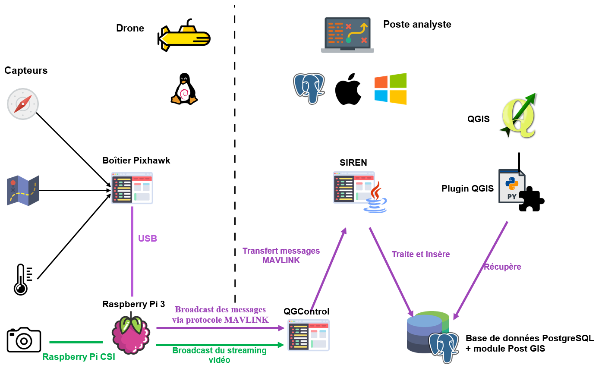
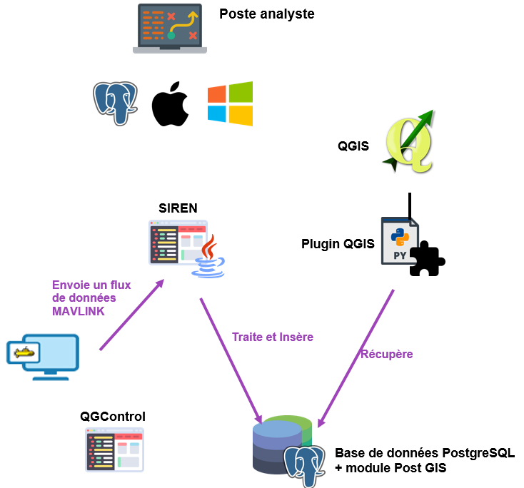
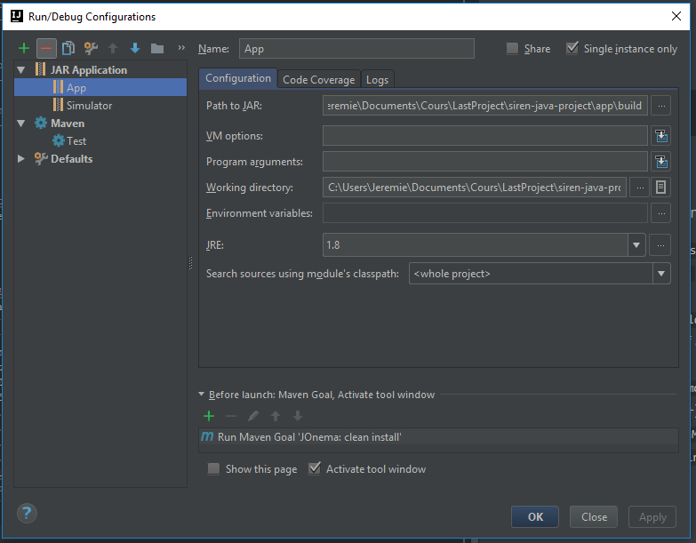
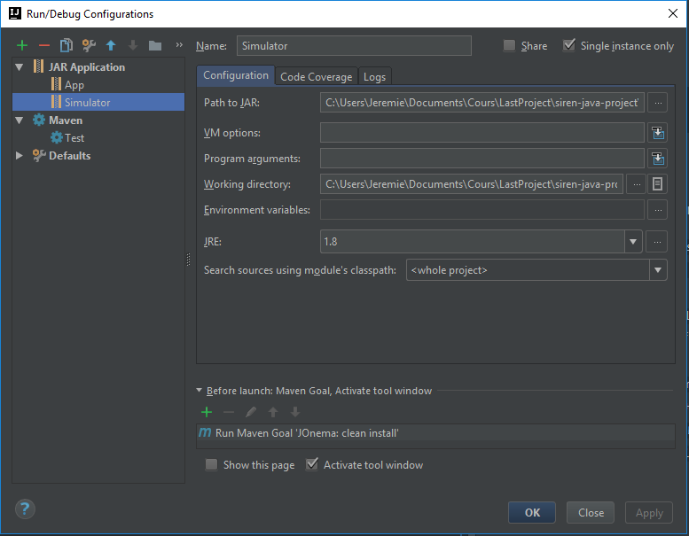
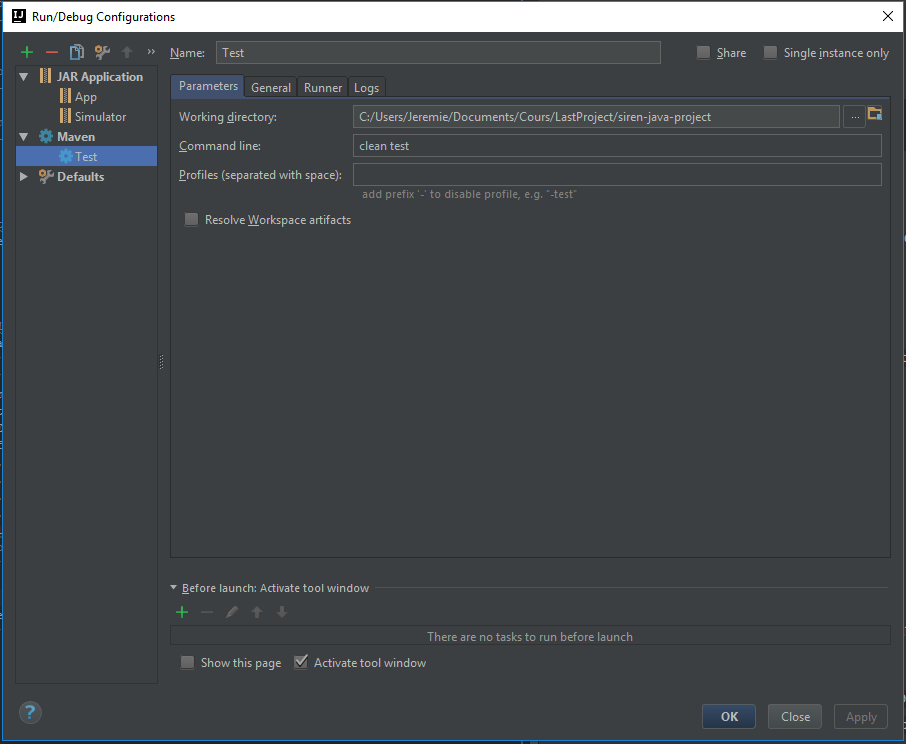

# Projet de développement de SIREN

## Description
Projet SIREN représentant une application JAVA permettant de positionner un drone sous-marin avec une précision de 50cm.
Le positionnement est stocké dans la base de données pour que celui-ci puisse ensuite être affiché dans QGIS.

## Architecture
- app
    > Centre de l'application. Cette partie représente la totalité du projet au niveau de l'interface graphique.
- lib
    > Coeur logique de l'application. Cette partie représente toute la partie librairie du projet. La librairie est utilisée par ```app``` et ```simulator```.
- simulator
    > Simulateur du drone. Cette partie représente la totalité de l'interface en ligne de commande du simulateur.

Architecture de SIREN

Architecture du Simulateur
   


## Prérequis logiciel
Les outils suivants sont requis :
- JDK 8u112 (+ JRE)
    - QAPlugin Suite
        - Checkstyle
        - FindBugs
        - PMD
- Scene Builder
- QGIS 2.18 (*optionnel* : remplacable par la VM de référence)
- IntelliJ Ultimate 2016.3
- PyCharm Professional 2016.3 (pour le dev QGIS/python - *si nécessaire*)
- CLion 2016.3 (pour le dev ArduSub - **si dev drone nécessaire**)
- VMware WorkStation
    - VM de référence : http://szymans.com/VM/AquaDrone-VM.zip
    - VM de développement ArduSub : http://szymans.com/VM/AquaDrone-Dev.zip

## Découpage des semaines
- S1 (06/02): Développement majeur
- S2 (13/02): Débuggage des applications et des algorithmes
- S3 (20/02): Développement de l'interface JavaFX (SIREN)
- S4 (27/02): Développement du module QGIS
- S5 (06/03) : Livraison et test du drone

## Lieutenants
Seul les lieutenants peuvent valider un merge request sur la branch ```MASTER``` du dépôt.
### Java
- **Thibault** YOU (*Code*)
- **Loïc** SZYMANSKI (*Code*)
- **François** VANDERPERRE (*Algorithme*)

### Python
- **Jérôme** GOASDOUE 

## Import du projet
Il est nécessaire que GIT soit installé sur le poste.
Pour configurer GIT lors de la première exécution :
```
git config --global user.name "John DOE"            # Prénom NOM
git config --global user.email johndoe@example.com  # Adresse email
```

Pour cloner le dépot en ligne de commande :
```
git clone https://lab.collombj.com/LastProject/siren-java-project.git
```

Pour cloner le dépot depuis une interface, il faut utiliser l'URL suivante :
> [https://lab.collombj.com/LastProject/siren-java-project.git](https://lab.collombj.com/LastProject/siren-java-project.git)

## Compilation et Exécution
### Compilation
Pour générer les JARs :
```
mvn clean install
```

Les jars sont stockés dans :
```
|--siren-java-project
    |--app
    |   |--build
    |       |--app-1.0.jar                       # JAR SIREN sans dépendances
    |       |--app-1.0-jar-with-dependencies.jar # JAR SIREN avec dépendances
    |--lib
    |   |--build
    |       |--lib-1.0.jar                       # JAR de la librairie (pour les dépendances)
    |--simulator
        |--build
            |--simulator-1.0.jar                       # JAR Simulateur sans dépendances
            |--simulator-1.0-jar-with-dependencies.jar # JAR Simulateur avec dépendances
```
**ATTENTION** : Les JARs ne sont pas présents dans le dépot de base. Il est impératif de les générer (soit par ligne de commande, soit avec IntelliJ) 
### Exécution
Pour lancer un JAR :
```
java -jar $nomDuJAR
```

### IntelliJ IDEA
La compilation et l'exécution dans IntelliJ IDEA requiert un paramétrage particulier.
1. ```Run``` > ```Edit Configurations...```
2. ```Add``` (+) > ```JAR Application```
    1. Name : ```App```
    2. Path to JAR : ```app/build/app-1.0-jar-with-dependencies.jar```
    3. JRE : ```1.8``` (JRE relatif à Java 8)
    4. Before Launch :
        1. Supprimer via ```Remove``` (-) toutes les entrées
        2. Ajouter via ```Add``` (+)
        3. Sélectionner ```Run Maven goal```
        4. Saisissez ```clean install```
    5. Valider
3.  ```App``` en haut à droite
4. ```Run``` (>) en haut à droite


Même chose à réaliser pour l'exécution du simulateur avec les paramètres suivants :
- Name : ```Simulator```
- Path to JAR : ```simulator/build/simulator-1.0-jar-with-dependencies.jar```
- Pour le lancement (étape 3), choisir ```Simulator``` au lieu de ```App```


App

Simulator


## Tests
Pour lancer les tests, il faut exécuter la commande suivante :
```
mvn clean test
```

Dans IntelliJ IDEA, il faut réaliser quelques manipulations :
1. ```Run``` > ```Edit Configurations...```
2. ```Add``` (+) > ```Maven```
    1. Name : ```Test```
    2. Working directory: ```siren-java-project``` (Chemin complet du répertoire racine du projet)
    3. Command line: ```clean test```
3.  ```Test``` en haut à droite
4. ```Run``` (>) en haut à droite




## Dépendances
Les dépendances sont gérées par Maven :
- ```JUnit:4.12``` (pour les tests uniquement)
- ```commons-cli:1.3.1```
- ```postgresql:9.4.1212```